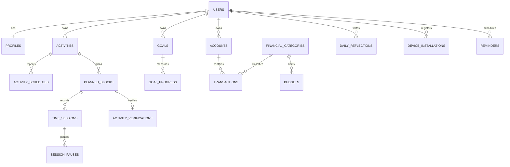

# Modelo entidad-relacion

```mermaid
erDiagram
  USERS ||--|| PROFILES : has
  USERS ||--o{ ACTIVITIES : owns
  ACTIVITIES ||--o{ ACTIVITY_SCHEDULES : repeats
  ACTIVITIES ||--o{ PLANNED_BLOCKS : plans
  PLANNED_BLOCKS ||--o{ TIME_SESSIONS : records
  TIME_SESSIONS ||--o{ SESSION_PAUSES : pauses
  PLANNED_BLOCKS ||--o| ACTIVITY_VERIFICATIONS : verifies
  USERS ||--o{ GOALS : owns
  GOALS ||--o{ GOAL_PROGRESS : measures
  USERS ||--o{ ACCOUNTS : owns
  ACCOUNTS ||--o{ TRANSACTIONS : contains
  FINANCIAL_CATEGORIES ||--o{ TRANSACTIONS : classifies
  FINANCIAL_CATEGORIES ||--o{ BUDGETS : limits
  USERS ||--o{ DAILY_REFLECTIONS : writes
  USERS ||--o{ DEVICE_INSTALLATIONS : registers
  USERS ||--o{ REMINDERS : schedules
```
